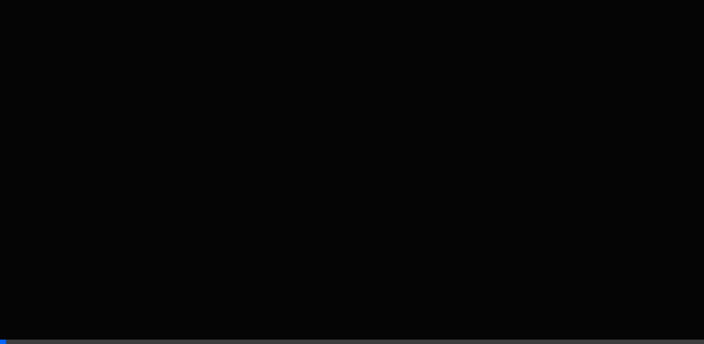

<div style="background-color: #1e1e1e; color: #ffffff; padding: 30px 20px; border-radius: 12px;">

<p align="center">
  
</p>

<h1 align="center" style="color: #ffffff;">
  Q R Y X
</h1>

<p align="center">
  <strong style="color: #45FF92;">Terminal-Themed QR Code Generator</strong>
</p>

<p align="center">
  <em>Generate · Style · Export — All from a cinematic terminal interface.</em>
</p>

<p align="center">
  
  
  
  
</p>

<p align="center">
  
</p>

---

## 🖥️ What is QRYX?

**QRYX** is a cinematic, terminal-themed QR code generator built for developers and designers who want full control over their QR codes — without leaving a command-line aesthetic.

It's not just a QR tool. It's a **developer experience** wrapped in a dark, immersive interface with:

- 🎯 **Slash-command system** — type commands like `/generate`, `/color`, `/style` to control every aspect of your QR code
- 🎨 **Deep customization** — change dot shapes, corner styles, foreground/background colors, and embed custom logos
- ⚡ **Real-time preview** — every command updates the QR code instantly on the right panel
- 📱 **Responsive layouts** — optimized desktop terminal layout + dedicated mobile interface
- 🎬 **Cinematic animations** — Lottie-powered QR reveal effects, scanline overlays, and flickering terminal boot sequences
- 📥 **Multi-format export** — download your QR codes as PNG, JPG, or SVG


## ⚙️ Commands Reference

All commands are typed into the terminal input at the bottom of the left panel.

### Generate a QR Code
```
/generate [url]
```
Creates a QR code for the given URL or text.
```
/generate https://github.com
```

### Color Customization
```
/color [flags]
```
| Flag | Description |
|------|-------------|
| `-bg [hex]` | Background color |
| `-fg [hex]` | Dots / foreground color |
| `-corners [hex]` | Corner squares (outer) |
| `-corners-dot [hex]` | Corner dots (inner) |

**Example — full neon theme:**
```
/color -bg #111111 -fg #00ffff -corners #ff00ff -corners-dot #ffff00
```

### Shape Styling
```
/style [part] [type]
```
| Part | Available Types |
|------|----------------|
| `dots` | `square`, `rounded`, `dots`, `classy`, `classy-rounded`, `extra-rounded` |
| `corners` | `square`, `dot`, `extra-rounded` |

```
/style dots classy
/style corners extra-rounded
```

### Logo Management
```
/add logo [url]       # Add a logo from URL
/add logo             # Open local file picker
/remove logo          # Remove the logo
```
```
/add logo https://upload.wikimedia.org/wikipedia/commons/a/a7/React-icon.svg
```

### Export
```
qr export [filename] [format]
```
Supported formats: `png`, `jpg`, `svg`
```
qr export my-neon-qr png
```

### Test & Help
```
qr test               # Run scan reliability check
/help                  # Show all available commands
```

---

## 🚀 Getting Started

```bash
# Clone the repository
git clone https://github.com/your-username/qryx.git
cd qryx

# Install dependencies
npm install

# Start dev server
npm run dev
```

The app will be available at `http://localhost:5173`.

### Build for Production
```bash
npm run build
npm run preview
```

---

## 🛠️ Tech Stack

| Technology | Purpose |
|---|---|
| **React 19** | UI framework |
| **Vite 7** | Build tool & dev server |
| **qr-code-styling** | QR code generation with style API |
| **Framer Motion** | Animations & micro-interactions |
| **Lottie React** | JSON-based cinematic animations |
| **JetBrains Mono** | Monospace font for terminal aesthetic |

---

## 📁 Project Structure

```
qryx/
├── public/
│   ├── logo.png                  # App favicon & logo
│   ├── QR_design.png             # OG image for social sharing
│   ├── qr-animation.json         # Lottie: QR pixel dissolve (intro)
│   ├── qr-reveal-animation.json  # Lottie: QR reveal on generate
│   └── loading.json              # Lottie: Preloader animation
├── src/
│   ├── App.jsx                   # Root: routes desktop vs mobile
│   ├── index.css                 # Design tokens & global styles
│   ├── main.jsx                  # React entry point
│   ├── components/
│   │   ├── TerminalLayout.jsx    # Desktop layout shell
│   │   ├── LeftPanel.jsx         # Command input & history
│   │   ├── RightPanel.jsx        # QR preview, stats, export
│   │   ├── MobileLayout.jsx      # Mobile responsive layout
│   │   ├── Preloader.jsx         # Boot sequence animation
│   │   ├── NoiseOverlay.jsx      # CRT noise & scanline effects
│   │   └── ErrorBoundary.jsx     # Error fallback UI
│   └── hooks/
│       ├── useQRSystem.js        # Core command engine & QR state
│       └── useIsMobile.js        # Responsive breakpoint hook
├── index.html                    # HTML shell with SEO meta tags
├── package.json
└── vite.config.js
```

---

## 📄 License

MIT © [Sarvar Sheikh](https://github.com/sarvarsheikh)

</div>
